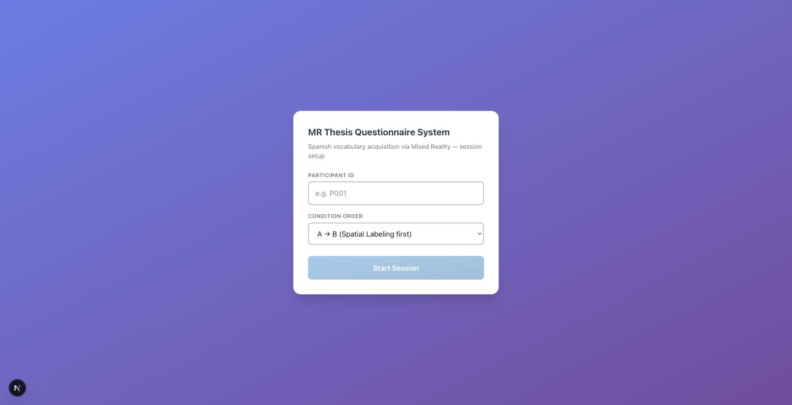
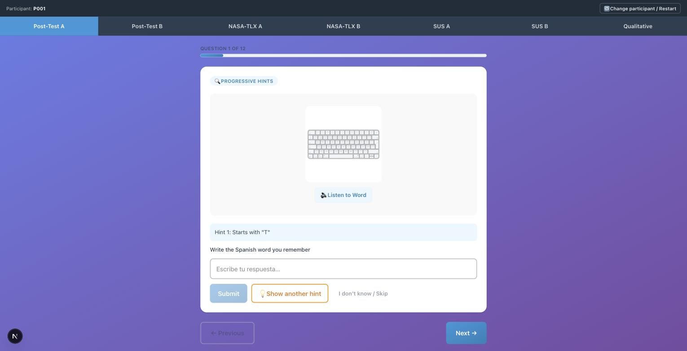
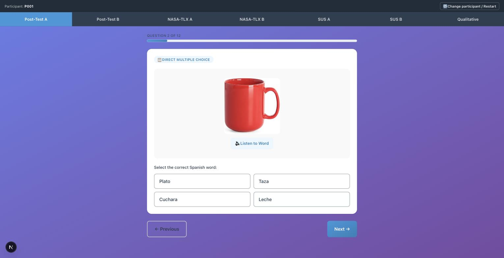
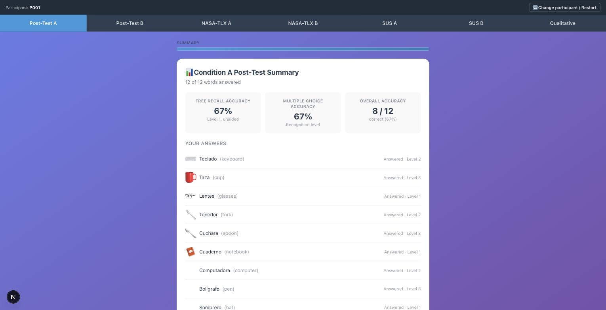
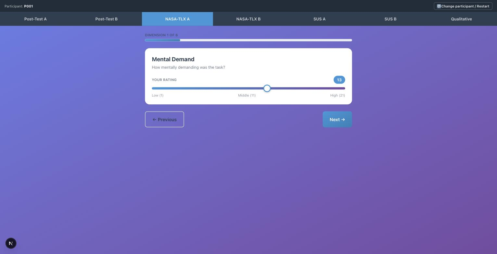
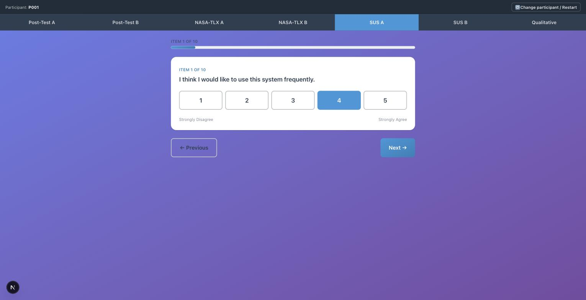
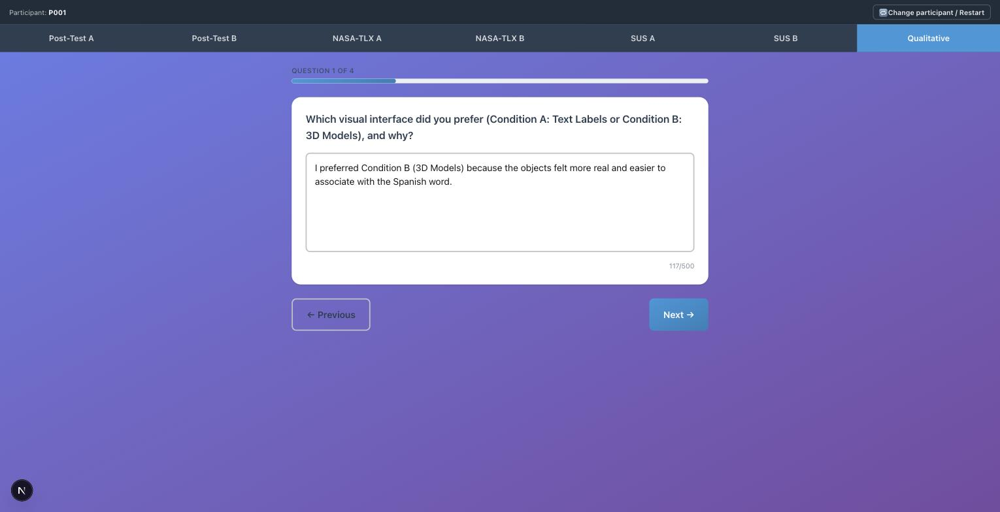
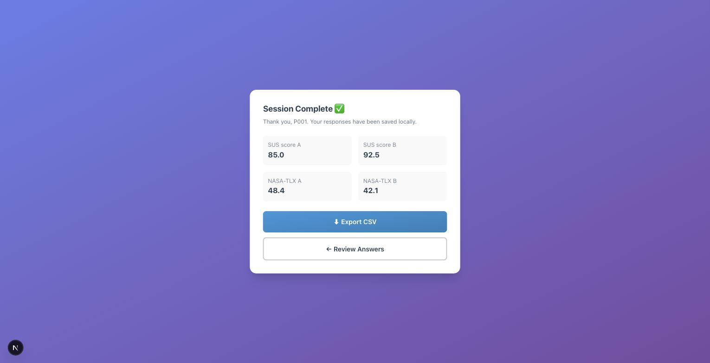

# MR Thesis Questionnaire System — User Guide

This web application is part of a research study about learning Spanish vocabulary with **Mixed Reality (MR)**. It compares two visual conditions:

- **Condition A — Spatial Labeling (Text Labels):** objects are marked with a text label.
- **Condition B — Object Augmented (3D Models):** objects are represented with 3D models.

This guide explains, step by step, what you will see and do during the session. It is written for **participants** who are about to take the survey.

> The whole session takes about **15–20 minutes**. You can go back to a previous question at any time with the **Previous** button.

---

## 1. Getting Started

When you open the app, you will see the setup screen.

1. Enter your **Participant ID** (the researcher will give you one, e.g. `P001`).
2. Leave the **Condition Order** as set by the researcher (it decides whether you try Condition A or Condition B first).
3. Click **Start Session**.

Once the session starts, do not close the browser tab — your progress is saved automatically in your browser as you go.

---

## 2. Navigating the Survey

At the top of the screen you will always see:

- **Tabs** — one per section (`Post-Test A`, `Post-Test B`, `NASA-TLX A`, `NASA-TLX B`, `SUS A`, `SUS B`, `Qualitative`). The highlighted tab shows where you are.
- **A progress bar** — shows how many questions are left in the current section.
- **Previous / Next buttons** at the bottom — use them to move between questions. On the very last question, the **Next** button becomes **Complete Session**.

You do not need to click the tabs yourself — the app moves you forward automatically as you answer. They are there so you (or the researcher) can review your answers if needed.

---

## 3. Post-Test: Vocabulary Questions

This is the main part of the study. You will go through **12 Spanish words for Condition A**, then **12 words for Condition B** (or the opposite order, depending on your assigned setup).

Every question shows:
- A picture of the object.
- A **🔊 Listen to Word** button — click it to hear the Spanish word out loud.

There are **two types of questions**, mixed throughout the test:

### 3.1 Progressive Hints (open-ended)

You type the Spanish word from memory.

- Type your answer in the text box and click **Submit**.
- If you are not sure, you can click **Show hint** — up to 2 hints are available (the first letter, then a short English definition).
- If you really don't remember, click **"I don't know / Skip"** to move on.
- You will **not** be told if your answer was right or wrong — this is intentional, so it does not affect your memory during the rest of the test. All results are summarized together at the end.

### 3.2 Direct Multiple Choice

You select the Spanish word from 4 options.

- Simply click the option you believe is correct.
- As with the previous question type, no immediate feedback is shown.

### 3.3 Post-Test Summary

After the 12th word of each condition, you will see a summary screen with your overall accuracy and a list of every word you answered.

This is just a review — click **Next** to continue to the next section.

---

## 4. NASA-TLX (Workload Questionnaire)

For each condition (A and B), you will rate **6 dimensions of mental workload** using a slider from **1 (low) to 21 (high)**.

The 6 dimensions are:

| Dimension | Question |
|---|---|
| Mental Demand | How mentally demanding was the task? |
| Physical Demand | How physically demanding was the task? |
| Temporal Demand | How rushed or pressured did you feel? |
| Performance | How successful were you in accomplishing the task? |
| Effort | How hard did you have to work to accomplish your performance? |
| Frustration | How insecure, discouraged, or frustrated did you feel? |

Drag the slider to the value that best matches how you felt, then click **Next**.

---

## 5. SUS (System Usability Scale)

For each condition, you will answer **10 standard usability statements** using a 1–5 scale.

For every statement, choose one option:

| Value | Meaning |
|---|---|
| 1 | Strongly Disagree |
| 2 | Disagree |
| 3 | Neutral |
| 4 | Agree |
| 5 | Strongly Agree |

Answer honestly and quickly — there are no right or wrong answers, only your personal opinion about the system you just used.

---

## 6. Qualitative Questions

At the end, you will answer **6 open-text questions** about your overall experience (up to 500 characters each).

The questions are:

1. Which visual interface did you prefer (Condition A: Text Labels or Condition B: 3D Models), and why?
2. Did you find the visual information in either condition overwhelming or distracting? Please explain.
3. How natural did the physical "poke" gesture feel? Did you experience any confusion on what to touch?
4. Which visual setup made it easier to focus on remembering the Spanish words, and why?
5. Did you experience any physical discomfort, visual fatigue, or technical issues?
6. Any other comments or suggestions?

Write in your own words — short, clear sentences are perfectly fine.

---

## 7. Finishing the Session

After the last qualitative question, click **Complete Session**. You will see your final scores and two options:

- **⬇ Export CSV** — downloads a `.csv` file with all of your answers to your computer. Please give this file to the researcher (they may ask you to email it or hand over a USB drive).
- **← Review Answers** — takes you back into the survey if you want to double-check something before exporting.

---

## 8. Tips

- **Restarting:** if you need to start over with a new participant, click **🔁 Change participant / Restart** in the top bar. This clears all current answers — only use it if instructed by the researcher.
- **Audio not playing?** Make sure your device's volume is on and the browser has permission to play sound.
- **Lost connection or closed the tab?** Your progress is saved automatically in the browser. Reopen the page and you will return to where you left off, as long as you use the same browser and device.
- **Technical issues?** Let the researcher know right away — mention it in question 5 of the Qualitative section as well.

Thank you for participating in this study!
